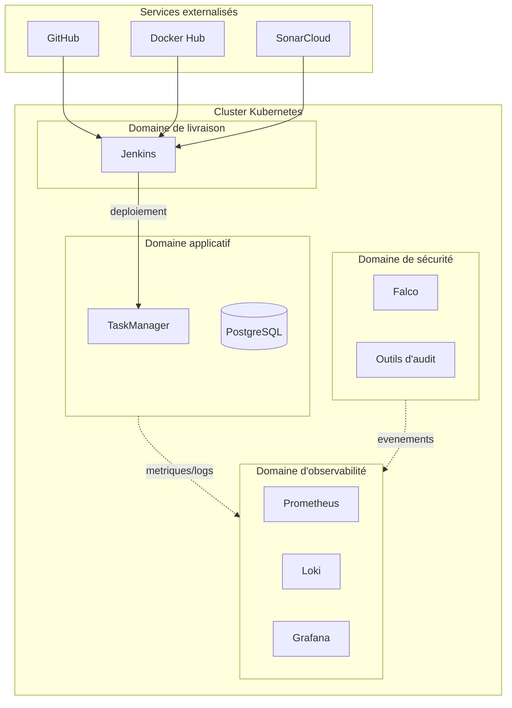
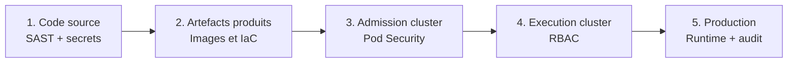
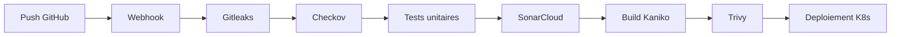
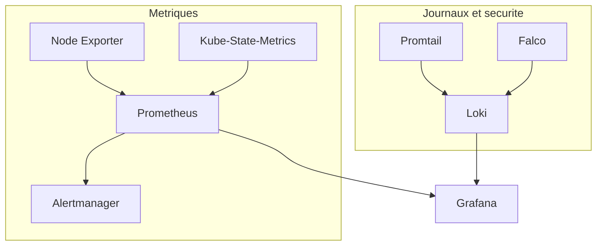
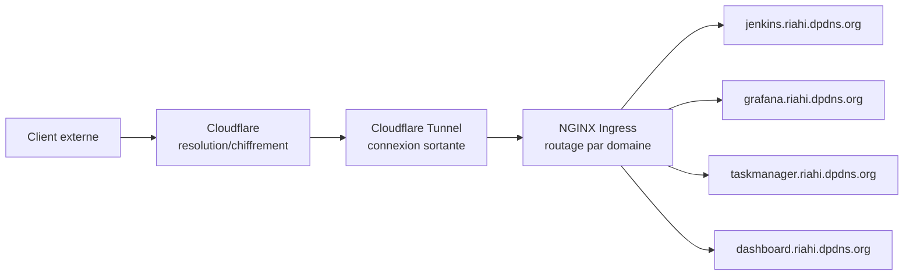

# Architecture de la plateforme DevSecOps

Ce document résume l'architecture technique de la plateforme. Pour le détail
complet (contexte, étude comparative, résultats de validation), voir le
[rapport de stage complet](https://fr.overleaf.com/read/rhdvqnvhjpkj#cba1d4).

## Vue d'ensemble

La plateforme s'organise autour d'un cluster Kubernetes unique, hébergeant
l'ensemble des composants à l'exception des services externalisés
(GitHub, SonarCloud, Docker Hub). Elle est structurée en quatre domaines
fonctionnels, isolés par des espaces de noms distincts.

**Mapping avec le repo :**

| Domaine | Dossier |
|---|---|
| Livraison | `ci-cd/` |
| Securite | `security/` |
| Applicatif | `k8s/taskmanager/` |
| Observabilite | `observability/` |

## Architecture de securite — defense en profondeur

Cinq niveaux de controle complementaires couvrent le cycle de vie logiciel,
du code source jusqu'a l'execution en production.

| Niveau | Outils | Dossier |
|---|---|---|
| Code source | Gitleaks, SonarCloud | `ci-cd/` |
| Artefacts | Checkov, Trivy | `ci-cd/`, `security/checkov/` |
| Admission cluster | Pod Security Standards | `k8s/pod-security/` |
| Execution cluster | RBAC | `k8s/rbac/` |
| Production | Falco, Kube-bench, Kube-hunter | `security/falco/`, `security/kube-bench-kube-hunter/` |

## Flux CI/CD

Chaque etape est bloquante : un seuil de securite depasse interrompt le
pipeline. Le pipeline s'execute via des agents Jenkins ephemeres (pods crees
a la demande), defini dans `ci-cd/jenkins-deployment.yaml`. Le `Jenkinsfile`
lui-meme est versionne dans le
[repo applicatif](https://github.com/RiahiAmani/flask-postgres-docker-compose)
(Pipeline as Code).

## Architecture d'observabilite

Configuration : `observability/prometheus/`, `observability/loki-promtail/`,
`observability/grafana/`.

## Modele d'exposition des services

Aucun port entrant n'est ouvert sur le reseau prive : le tunnel etablit une
connexion sortante vers l'infrastructure Cloudflare. Configuration :
`ingress-exposition/`.

## Resilience et scaling

- Sauvegarde : script `resilience/backup-etcd.sh`, execution quotidienne
  via Cron, retention 7 jours, snapshot copie vers la machine hote.
- Scaling horizontal : `scaling/hpa-taskmanager.yaml` (Horizontal Pod
  Autoscaler, seuil CPU).
- Scaling vertical : `scaling/taskmanager-app-vpa.yaml` et
  `taskmanager-postgres-vpa.yaml` (Vertical Pod Autoscaler, mode
  recommandation uniquement).

## Pour aller plus loin

Voir le [guide de reproduction complet](../README.md) pour deployer cette
architecture depuis zero, et le
[rapport de stage](https://fr.overleaf.com/read/rhdvqnvhjpkj#cba1d4) pour
l'etude comparative des technologies et les resultats detailles de
validation.
